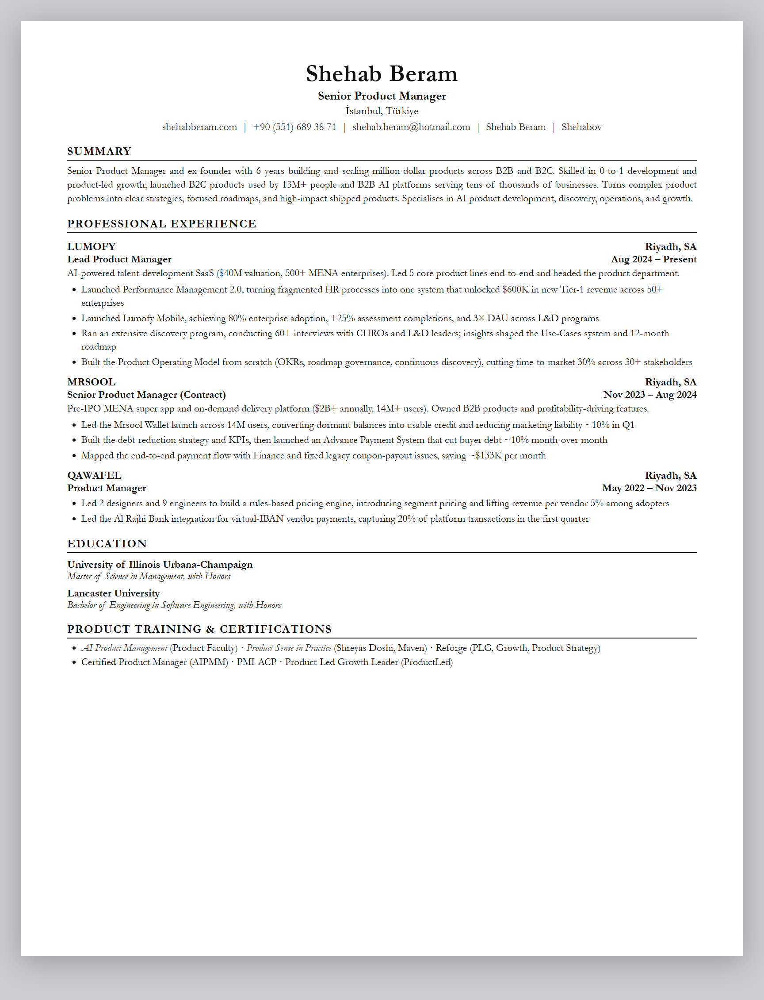
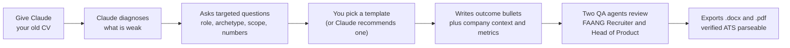
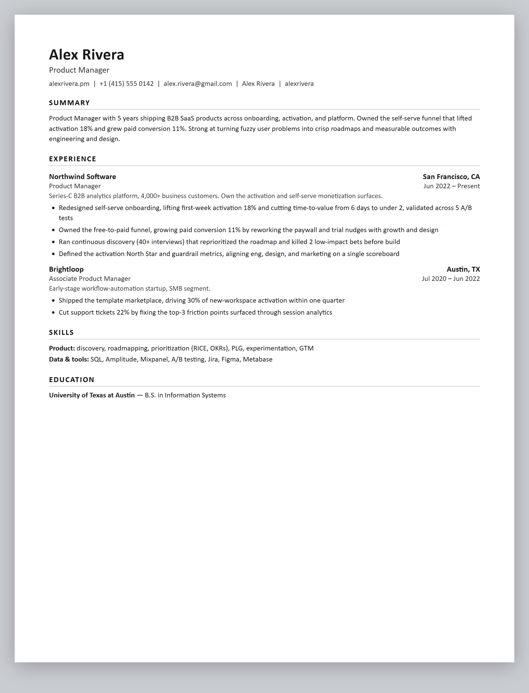
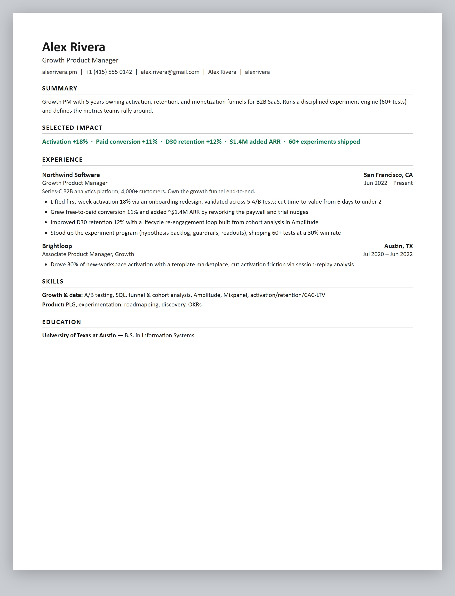
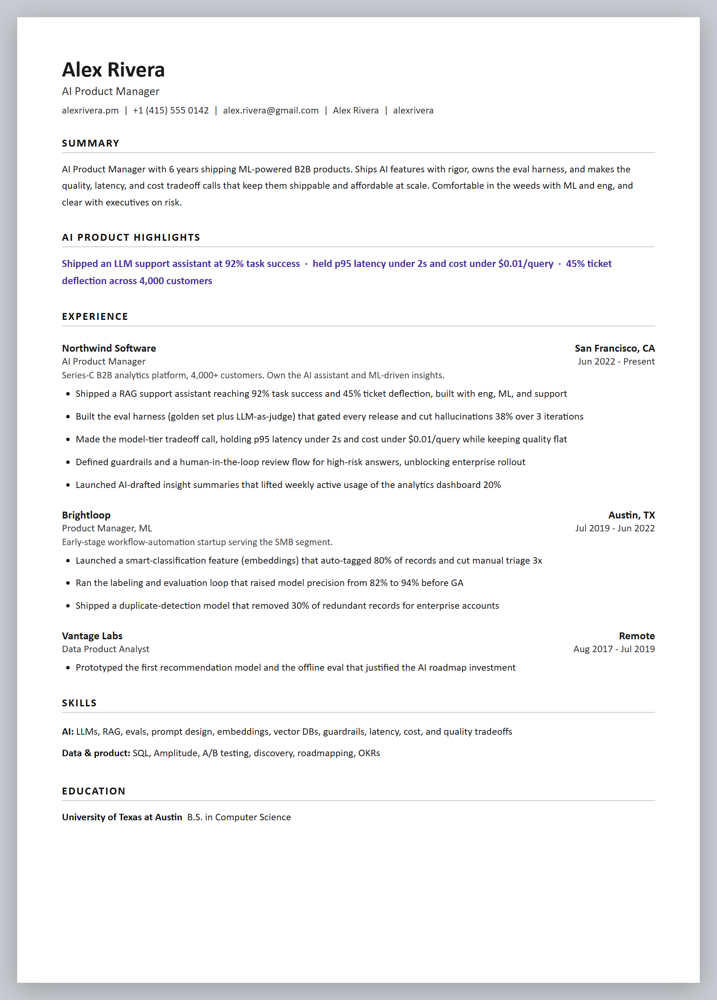
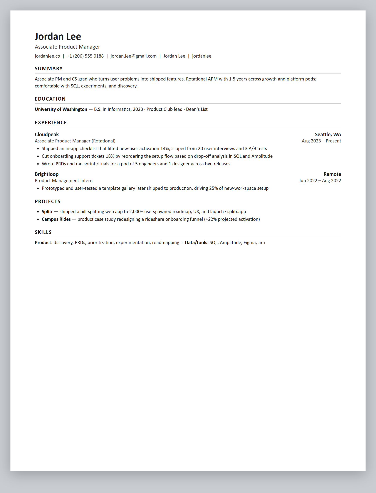

<div align="center">

# PM Resume Builder

**A Claude Skill for product managers.**
It reads your old CV, asks the right questions, and ships a sharp, recruiter grade, ATS guaranteed product manager resume in the template you choose.

<p>


</p>



</div>

---

## Contents

- [What it does](#what-it-does)
- [How it works](#how-it-works)
- [Built-in QA, two review agents](#built-in-qa-two-review-agents)
- [Trigger phrases](#trigger-phrases)
- [The 5 templates](#the-5-templates-all-ats-guaranteed)
- [Install](#install)
- [Works with your MCPs](#works-with-your-mcps)
- [Documentation](#documentation)
- [Knowledge sources](#knowledge-sources)
- [CV key principles](#cv-key-principles)
- [Repository structure](#repository-structure)
- [License](#license)

---

## What it does

This skill turns Claude into a product manager resume expert. It is not a generic resume tool. Every rule is tuned for how PMs are actually screened: a recruiter spends 6 to 8 seconds on the first pass and looks for years of PM experience, the scope you owned, and quantified product outcomes such as activation, retention, revenue, adoption, and launches.

It will:

- **Rebuild your resume from your old one.** It reads it, tells you what is weak, asks the right questions, and ships a better one.
- **Write outcome bullets, not duty bullets,** using the PM TAR formula (Task, Action, Result) with the metric pushed to the front.
- **Show the right metrics for your archetype:** Growth, Core, Platform, Monetization, 0 to 1, or AI PM. See the [metrics guide](./skill/references/pm-metrics-and-impact.md).
- **Guarantee ATS parseability:** single column, standard fonts, text based PDF, no tables for layout and no graphics, verified with `pdftotext` on export.
- **Put it through two QA agents before it ships.** A strict FAANG recruiter pass and a Head of Product story pass catch weak bullets, generic sameness, and gaps in your story, and surface anything that needs your call.
- **Deliver both `.docx` and `.pdf`,** one to edit and one to send.
- **Tailor to a job description** by mirroring its language and reordering to what the role screens for, without fabricating anything.

---

## How it works



The flow, in words:

1. **Give it your current CV** (attach a PDF or DOCX, or paste it). No CV? It builds from scratch.
2. **It diagnoses** the resume in a few honest lines against PM best practices.
3. **It asks** only what it needs: target role and seniority, your PM archetype, the scope you owned per role, and, where most PM resumes fail, the numbers.
4. **You choose a template** (or ask for a recommendation by seniority and archetype).
5. **Two QA agents review it** before anything ships (see below).
6. **It ships** the resume in that template as `.docx` plus `.pdf`, then runs a full ATS and quality checklist.

> Nothing is invented. If a metric is unknown, Claude asks or uses an honest scale statement. Everything on the resume must survive an interview.

---

## Built-in QA, two review agents

Before the resume ships, it goes through two strict review passes. Each one is a persona Claude fully adopts, and each writes you a short, blunt report. The rule for both: they review only what the resume actually says and what you told Claude, so they flag gaps as questions and never invent a fact to fill one.

| Agent | Plays | What it checks |
|---|---|---|
| **The FAANG Recruiter** | A senior tech recruiter screening in 6 to 8 seconds | Outcome bullets, metrics with a baseline, archetype match, ATS mechanics, keyword mirroring, no fabrication, and the sameness trap: near-identical bullets or content so generic it could belong to any PM. Verdict is SCREEN or PASS, with the fixes that flip it. |
| **The Head of Product** | A Head of Product reading your resume as a career story | The throughline, whether scope grows over time, the strategy-execution-impact arc, and any gaps, date overlaps, or places where the summary promises what the experience does not back. |

Why two: the recruiter makes sure it survives the screen, the Head of Product makes sure it tells a coherent, rising story. When two answers come back nearly identical, or a story has a hole, the skill surfaces it to you instead of shipping it quietly. Full rubrics are in [`qa-review-agents.md`](./skill/references/qa-review-agents.md).

---

## Trigger phrases

You do not need a special command. Once the skill is installed, Claude picks it up from plain language. Any of these will start it:

**Build a new resume**
- "Create my resume" or "Build my CV"
- "Help me make a product manager resume"
- "I need a PM resume from scratch"
- "Turn my LinkedIn into a resume"

**Improve an existing one**
- "Optimize my resume" or "Improve my CV"
- "Review my resume" or "Give me a resume review"
- "What is weak in my resume?"
- "Rewrite my bullets to show impact"

**Pass the ATS**
- "Make it ATS friendly"
- "Will this pass an ATS?"
- "Format my resume for applicant tracking systems"

**Tailor to a role**
- "Tailor my resume to this job description"
- "Match my CV to this PM role"
- "Help me apply for this job"

**Other ways in**
- "Help me get hired as a PM"
- "Hoja de vida" or "Curriculum vitae"
- Any mention of a job application together with resume or CV

When more than one could apply, Claude asks a quick clarifying question before it starts.

---

## The 5 templates (all ATS guaranteed)

Every template is single column, standard font, text based, and graphics free, so it parses cleanly in Greenhouse, Workday, Lever, Ashby, iCIMS, and Taleo. "ATS guaranteed" means the exported PDF returns clean, ordered text via `pdftotext`, which the skill verifies on export.

| Preview | Template | Best for | Trigger |
|---|---|---|---|
|  | **01 Executive Serif** | Senior, Lead, Director, Head of Product, CPO, and ex founders | *"use the Executive Serif template"* or *"template 1"* |
|  | **02 Modern Minimal** | Mid level PM at a modern tech company (the safe default) | *"Modern Minimal template"* or *"template 2"* |
|  | **03 Growth and Metrics** | Growth or Data PM. Adds a "Selected Impact" metrics strip | *"Growth Metrics template"* or *"template 3"* |
|  | **04 AI Product** | AI or ML PM. Foregrounds evals and latency, cost, quality tradeoffs | *"AI Product template"* or *"template 4"* |
|  | **05 Associate One Pager** | APM, early career, or switcher. Projects carry weight | *"Associate one pager"* or *"template 5"* |

> Template 01 is modeled on a real, senior PM resume in [`examples/`](./examples/). Not sure which to pick? Ask Claude and it recommends one by your seniority and archetype and explains why. The build spec for each is in [`templates/<id>/spec.md`](./templates/), and the full detail is in [`pm-templates.md`](./skill/references/pm-templates.md).

---

## Install

**Claude.ai (easiest):** download [`pm-resume-builder.skill`](./pm-resume-builder.skill), then open **Settings, Skills, Upload**, and say *"help me build my PM resume."*

**Claude Code:**
```bash
git clone https://github.com/Shehabov/pm-resume-builder-skill.git
cp -r pm-resume-builder-skill/skill/ ~/.claude/skills/user/pm-resume-builder/
```

Full walkthrough with all three methods and examples: **[docs/INSTALLATION.md](./docs/INSTALLATION.md)**.

---

## Works with your MCPs

The skill works on its own with an attached file. It gets more powerful when you connect an MCP, because Claude can then read your inputs and hand back the finished files where you actually keep them, in one conversation.

| If you connect | The skill can |
|---|---|
| **Google Drive / Docs MCP** | Read your current CV straight from Drive, then save the finished `.docx` and `.pdf` back to a folder you name, no upload or download step |
| **Gmail MCP** | Pull a job description out of a recruiter email, then draft the application reply with the tailored resume ready to attach (it drafts, you send) |
| **Filesystem MCP** (Claude Code, desktop) | Read the CV from a local path and write both files next to it |
| **Notion or Confluence MCP** | Pull role details or your brag document, and drop a copy of the resume into your job search page |
| **A web or fetch MCP** | Read a job description from a posting URL you paste, then tailor to it |

How it looks in practice:

> "Read my CV from Google Drive, rebuild it in the Growth and Metrics template, tailor it to the JD in this email, and save both files back to my Job Search folder."

Claude reads the CV over the Drive MCP, pulls the JD over the Gmail MCP, runs the normal diagnose, ask, write, verify flow, then writes the `.docx` and `.pdf` back over the Drive MCP. No MCP is required. Anything the skill cannot reach, it simply asks you to paste or attach.

> Guardrails still apply. Claude drafts emails and saves files, and it asks before it sends anything or changes anything you did not request.

---

## Documentation

| Doc | What is inside |
|---|---|
| [`docs/INSTALLATION.md`](./docs/INSTALLATION.md) | Install (3 ways), the flow, the template chooser, good practice |
| [`docs/SOURCES.md`](./docs/SOURCES.md) | Full source traceability, and the choices this skill makes for PMs |
| [`skill/SKILL.md`](./skill/SKILL.md) | The main instructions Claude follows (the flow and the checklist) |
| [`skill/references/pm-bullet-writing.md`](./skill/references/pm-bullet-writing.md) | PM bullet formula, action verbs, before and after |
| [`skill/references/pm-metrics-and-impact.md`](./skill/references/pm-metrics-and-impact.md) | Metrics by PM archetype, quantifying vague wins |
| [`skill/references/pm-resume-structure.md`](./skill/references/pm-resume-structure.md) | Sections, summary, layout, fonts, ATS export |
| [`skill/references/ats-and-keywords.md`](./skill/references/ats-and-keywords.md) | ATS reality, a PM keyword bank, JD tailoring |
| [`skill/references/common-mistakes.md`](./skill/references/common-mistakes.md) | PM specific traps to avoid, including the sameness trap |
| [`skill/references/qa-review-agents.md`](./skill/references/qa-review-agents.md) | The two QA passes: FAANG Recruiter and Head of Product |
| [`skill/references/pm-templates.md`](./skill/references/pm-templates.md) | The 5 templates and how to trigger each |

---

## Knowledge sources

This skill was built by researching and synthesizing the best product manager resume writing with proven resume science. Full traceability is in [`docs/SOURCES.md`](./docs/SOURCES.md).

| Source | What it covers |
|---|---|
| [IGotAnOffer, Product Manager Resume (13 FAANG examples)](https://igotanoffer.com/blogs/product-manager/product-manager-resume) | PM sections, keyword bank, real Google, Meta, and Amazon examples |
| [Exponent, Perfect PM Resume (2026)](https://www.tryexponent.com/blog/how-to-write-the-perfect-product-manager-resume) | Metric to archetype matching, the bullet formula, 2026 signals |
| [HustleBadger, Write a PM Resume](https://www.hustlebadger.com/what-do-product-teams-do/write-a-pm-resume/) | Impact not process, TAR and CAR structure, the 6 to 8 second scan |
| Reforge, Amplitude and Mixpanel, Lenny Rachitsky, Shreyas Doshi | Growth metrics, analytics conventions, product sense framing |
| [Harvard Career Services](https://careerservices.fas.harvard.edu/resources/create-a-strong-resume/) | Language principles, action verbs, top mistakes |
| [r/EngineeringResumes](https://www.reddit.com/r/EngineeringResumes/wiki/index/) | Tech specific, community tested formatting patterns that survive real ATS screens |
| [The Tech Resume Inside Out](https://thetechresume.com/samples/ats-myths-busted) | The hiring pipeline, ATS myths debunked, the recruiter perspective |
| [Tech Interview Handbook](https://www.techinterviewhandbook.org/resume/) | FAANG resume optimization and ATS friendly formatting |
| Google XYZ formula, Columbia STAR, Lever | Achievement based bullets, ATS reality |

---

## CV key principles

1. **Outcomes, not duties.** Every bullet says what changed and by how much, never "Responsible for the roadmap."
2. **"Cross functional" is not an achievement.** It is the job. Show what you drove, with whom, to what result.
3. **Quantify like a PM.** Revenue, activation, retention, adoption, conversion, NPS, time to market, with digits and a baseline.
4. **A company context line per role.** One line on what the company is, its scale, and what you owned. This is the PM version of domain context and the single biggest differentiator.
5. **Match metrics to the target role.** Growth screens for activation, platform for latency, monetization for revenue.
6. **Show the arc: strategy, execution, impact.** Senior leads with strategy, early career leads with shipped features.
7. **Keep a strong 3 to 5 line summary.** Years of experience, scope, and a signature number, aimed at the role.
8. **One page under about 5 years, two beyond.** Recent roles get 5 to 7 bullets, old roles shrink to 2 or 3.
9. **ATS means clean and scannable, not keyword stuffed.** Single column, standard headings, text based PDF.

---

## Repository structure

```
pm-resume-builder-skill/
├── README.md                       (you are here)
├── LICENSE                         (MIT)
├── pm-resume-builder.skill         (installable skill file for Claude.ai)
├── skill/                          (the skill source)
│   ├── SKILL.md                    (main instructions: the flow and checklist)
│   └── references/
│       ├── pm-bullet-writing.md
│       ├── pm-metrics-and-impact.md
│       ├── pm-resume-structure.md
│       ├── ats-and-keywords.md
│       ├── common-mistakes.md
│       ├── qa-review-agents.md
│       └── pm-templates.md
├── templates/                      (5 ATS guaranteed templates)
│   ├── 01-executive-serif/         (spec.md, preview.html, preview.png)
│   ├── 02-modern-minimal/
│   ├── 03-growth-metrics/
│   ├── 04-ai-product/
│   └── 05-associate-onepager/
├── docs/
│   ├── INSTALLATION.md
│   └── SOURCES.md
└── examples/
    └── Shehab-Beram-Senior-PM-Resume.pdf   (the real resume behind template 01)
```

---

## License

MIT. See [LICENSE](./LICENSE). Use it, fork it, ship better resumes.

<div align="center">
<sub>Built by <a href="https://www.shehabberam.com/">Shehab Beram</a>, Forward Deployed Product Manager. Part of the <a href="https://github.com/Shehabov">Claude Skills</a> collection.</sub>
</div>
