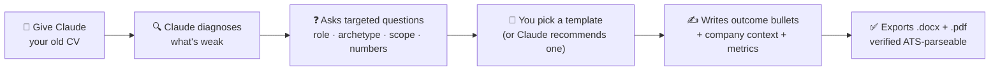

<div align="center">

# 🧩 PM Resume Builder — a Claude Skill

**Turn a messy product history into a sharp, recruiter-grade, ATS-guaranteed product-manager resume.**
Claude reads your old CV, asks the right questions, and ships the perfect one in the template you choose.

<p>


</p>


</div>

---

## Contents

- [What it does](#what-it-does)
- [How it works](#how-it-works)
- [The 5 templates](#the-5-templates-all-ats-guaranteed)
- [Install](#install)
- [Documentation](#documentation)
- [Knowledge sources](#knowledge-sources)
- [CV key principles](#cv-key-principles)
- [Repository structure](#repository-structure)
- [License](#license)

---

## What it does

This skill turns Claude into a **product-manager resume expert**. It is not a generic resume tool — every rule is tuned for how PMs are actually screened: a recruiter spends **6-8 seconds** on the first pass and looks for **years of PM experience, the scope you owned, and quantified product outcomes** (activation, retention, revenue, adoption, launches).

It will:

- **Rebuild your resume from your old one** — read it, tell you what's weak, ask the right questions, and ship a better one.
- **Write outcome bullets, not duty bullets** — using the PM `TAR` (Task → Action → Result) formula with the metric pushed to the front.
- **Show the right metrics for your archetype** — Growth, Core, Platform, Monetization, 0→1, or AI PM (see [metrics guide](./skill/references/pm-metrics-and-impact.md)).
- **Guarantee ATS-parseability** — single column, standard fonts, text-based PDF, no tables-for-layout or graphics; verified with `pdftotext` on export.
- **Deliver both `.docx` and `.pdf`** — one to edit, one to send.
- **Tailor to a job description** — mirror the JD's language and reorder to what the role screens for, without fabricating anything.

---

## How it works



The flow, in words:

1. **Give it your current CV** (attach a PDF/DOCX or paste it). No CV? It builds from scratch.
2. **It diagnoses** the resume in a few honest lines against PM best practices.
3. **It asks** only what it needs: target role and seniority, your PM archetype, the scope you owned per role, and — where most PM resumes fail — the **numbers**.
4. **You choose a template** (or ask for a recommendation by seniority + archetype).
5. **It ships** the resume in that template as **`.docx` + `.pdf`**, then runs a full ATS + quality checklist.

> **Nothing is invented.** If a metric is unknown, Claude asks or uses an honest scale statement. Everything on the resume must survive an interview.

---

## The 5 templates (all ATS-guaranteed)

Every template is **single-column, standard-font, text-based, and graphics-free**, so it parses cleanly in Greenhouse, Workday, Lever, Ashby, iCIMS, and Taleo. "ATS-guaranteed" means the exported PDF returns clean, ordered text via `pdftotext` — the skill verifies this on export.

| Preview | Template | Best for | Trigger |
|---|---|---|---|
|  | **01 · Executive Serif** 🎩 | Senior / Lead / Director / Head / CPO, ex-founders | *"use the Executive Serif template"* / *"template 1"* |
|  | **02 · Modern Minimal** ▤ | Mid-level PM at a modern tech company (safe default) | *"Modern Minimal template"* / *"template 2"* |
|  | **03 · Growth / Metrics** 📈 | Growth / Data PM — a "Selected Impact" metrics strip | *"Growth Metrics template"* / *"template 3"* |
|  | **04 · AI Product** 🤖 | AI / ML PM — foregrounds evals + latency/cost tradeoffs | *"AI Product template"* / *"template 4"* |
|  | **05 · Associate One-Pager** 🌱 | APM / early-career / switcher — Projects carry weight | *"Associate one-pager"* / *"template 5"* |

> Template **01** is modeled on a real, senior PM resume ([`examples/`](./examples/)). Not sure which to pick? Ask Claude — it recommends one by your seniority and archetype and explains why. Full spec for each is in [`templates/<id>/spec.md`](./templates/), and the details are in [`pm-templates.md`](./skill/references/pm-templates.md).

---

## Install

**Claude.ai (easiest):** download [`pm-resume-builder.skill`](./pm-resume-builder.skill) → **Settings → Skills → Upload** → say *"help me build my PM resume."*

**Claude Code:**
```bash
git clone https://github.com/Shehabov/pm-resume-builder-skill.git
cp -r pm-resume-builder-skill/skill/ ~/.claude/skills/user/pm-resume-builder/
```

Full walkthrough (all three methods + examples): **[docs/INSTALLATION.md](./docs/INSTALLATION.md)**.

---

## Documentation

| Doc | What's inside |
|---|---|
| [`docs/INSTALLATION.md`](./docs/INSTALLATION.md) | Install (3 ways), the flow, template chooser, good practice |
| [`docs/SOURCES.md`](./docs/SOURCES.md) | Full source traceability + how PM adaptations differ from a general resume |
| [`skill/SKILL.md`](./skill/SKILL.md) | The main instructions Claude follows (the flow + checklist) |
| [`skill/references/pm-bullet-writing.md`](./skill/references/pm-bullet-writing.md) | PM bullet formula, action verbs, before/after |
| [`skill/references/pm-metrics-and-impact.md`](./skill/references/pm-metrics-and-impact.md) | Metrics by PM archetype, quantifying vague wins |
| [`skill/references/pm-resume-structure.md`](./skill/references/pm-resume-structure.md) | Sections, summary, layout, fonts, ATS export |
| [`skill/references/ats-and-keywords.md`](./skill/references/ats-and-keywords.md) | ATS reality + PM keyword bank + JD tailoring |
| [`skill/references/common-mistakes.md`](./skill/references/common-mistakes.md) | PM-specific traps to avoid |
| [`skill/references/pm-templates.md`](./skill/references/pm-templates.md) | The 5 templates + triggers |

---

## Knowledge sources

Built by synthesizing the best PM-resume writing with foundational resume science. Full traceability in [`docs/SOURCES.md`](./docs/SOURCES.md).

**Product-manager-specific (new):**

| Source | Covers |
|---|---|
| [IGotAnOffer — PM Resume (13 FAANG examples)](https://igotanoffer.com/blogs/product-manager/product-manager-resume) | PM sections, keyword bank, real Google/Meta/Amazon examples |
| [Exponent — Perfect PM Resume (2026)](https://www.tryexponent.com/blog/how-to-write-the-perfect-product-manager-resume) | Metric-to-archetype matching, bullet formula, 2026 signals |
| [HustleBadger — Write a PM Resume](https://www.hustlebadger.com/what-do-product-teams-do/write-a-pm-resume/) | Impact-not-process, TAR/CAR structure, the 6-8s scan |
| Reforge · Amplitude/Mixpanel · Lenny Rachitsky · Shreyas Doshi | Growth metrics, analytics conventions, product-sense framing |

**Foundational resume science (carried over from the base skill, adapted for PMs):**

| Source | Covers |
|---|---|
| [Harvard Career Services](https://careerservices.fas.harvard.edu/resources/create-a-strong-resume/) | Language principles, action verbs, top-5 mistakes |
| [r/EngineeringResumes wiki](https://www.reddit.com/r/EngineeringResumes/) | Formatting mechanics, dates, ATS-safe fonts |
| [The Tech Resume Inside Out](https://thetechresume.com/samples/ats-myths-busted) | ATS myths debunked, the hiring pipeline |
| Google XYZ formula · Columbia STAR · Lever | Achievement-based bullets, ATS reality |

---

## CV key principles

1. **Outcomes, not duties.** Every bullet says what changed and by how much — never "Responsible for the roadmap."
2. **"Cross-functional" is not an achievement.** It's the job. Show *what you drove, with whom, to what result.*
3. **Quantify like a PM.** Revenue, activation, retention, adoption, conversion, NPS, time-to-market — with digits and a baseline.
4. **A company-context line per role.** One line on what the company is, its scale, and what you owned. This is the PM's "domain context" and the single biggest differentiator.
5. **Match metrics to the target role.** Growth screens for activation; platform for latency; monetization for revenue.
6. **Show the arc: strategy → execution → impact.** Senior leads with strategy; early-career leads with shipped features.
7. **Keep a strong 3-5 line summary.** Years of experience + scope + a signature number, aimed at the role.
8. **One page under ~5 years, two beyond.** Recent roles get 5-7 bullets; old roles shrink to 2-3.
9. **ATS = clean + scannable, not keyword-stuffed.** Single column, standard headings, text-based PDF.

---

## Repository structure

```
pm-resume-builder-skill/
├── README.md                       ← you are here
├── LICENSE                         ← MIT
├── pm-resume-builder.skill         ← installable skill file for Claude.ai
├── skill/                          ← the skill source
│   ├── SKILL.md                    ← main instructions (flow + checklist)
│   └── references/
│       ├── pm-bullet-writing.md
│       ├── pm-metrics-and-impact.md
│       ├── pm-resume-structure.md
│       ├── ats-and-keywords.md
│       ├── common-mistakes.md
│       └── pm-templates.md
├── templates/                      ← 5 ATS-guaranteed templates
│   ├── 01-executive-serif/         ← spec.md · preview.html · preview.png
│   ├── 02-modern-minimal/
│   ├── 03-growth-metrics/
│   ├── 04-ai-product/
│   └── 05-associate-onepager/
├── docs/
│   ├── INSTALLATION.md
│   └── SOURCES.md
└── examples/
    └── Shehab-Beram-Senior-PM-Resume.pdf   ← the real resume behind template 01
```

---

## License

MIT — see [LICENSE](./LICENSE). Use it, fork it, ship better resumes.

<div align="center">
<sub>Built by <a href="https://www.shehabberam.com/">Shehab Beram</a>, Forward Deployed Product Manager · part of the <a href="https://github.com/Shehabov">Claude Skills</a> collection</sub>
</div>
